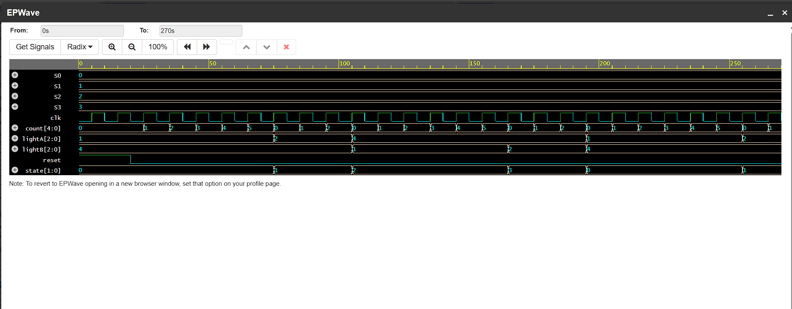
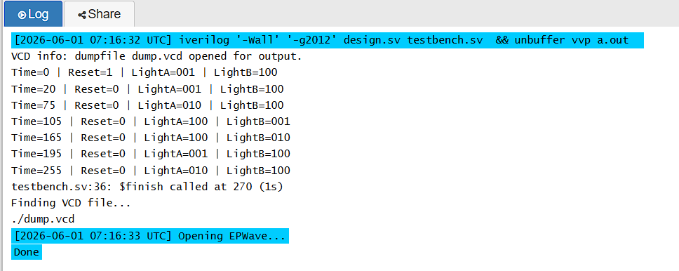

# Traffic Light Controller using Verilog

## Overview

This project implements a Traffic Light Controller using a Finite State Machine (FSM) in Verilog. The controller changes the traffic lights based on predefined states and timing. The design was simulated to verify that each state transition and output worked as expected.

---

## Project Objective

The objective of this project was to understand the implementation of Finite State Machines in Verilog and verify the functionality using simulation.

---

## Features

- Finite State Machine (FSM) based design
- Four traffic light states
- Counter-based state transition
- Asynchronous reset
- Simulation using a Verilog testbench

---

## State Sequence

```
S0 → S1 → S2 → S3 → S0
```

| State | Light A | Light B |
|-------|---------|---------|
| S0 | Green | Red |
| S1 | Yellow | Red |
| S2 | Red | Green |
| S3 | Red | Yellow |

---

## Files Included

- `design.v` – Traffic Light Controller design
- `testbench.v` – Testbench used for simulation
- `images/` – Simulation waveform and output screenshots

---

## Simulation

The design was simulated using **EDA Playground** with **Icarus Verilog** as the simulator. The waveform was viewed using **EPWave** to verify the state transitions and output signals.

---

## Development Process

1. Defined four FSM states for the traffic light sequence.
2. Implemented the state transition logic using a counter.
3. Assigned output values for both traffic lights in each state.
4. Wrote a testbench to generate the clock and reset signals.
5. Simulated the design using EDA Playground.
6. Verified the output using the simulation log and waveform.

---

## Tools Used

- Verilog HDL
- EDA Playground
- Icarus Verilog
- EPWave

---

## Screenshots

### Simulation Waveform



### Simulation Output



---
## Future Improvements

- Add pedestrian crossing support
- Make timing values configurable
- Add emergency vehicle priority
- Implement the design on an FPGA

---
## Author
**Naveen**
